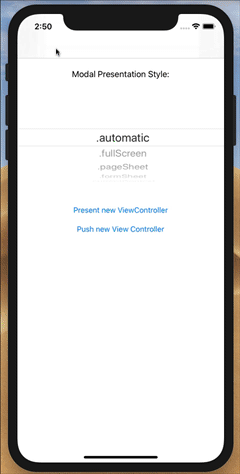
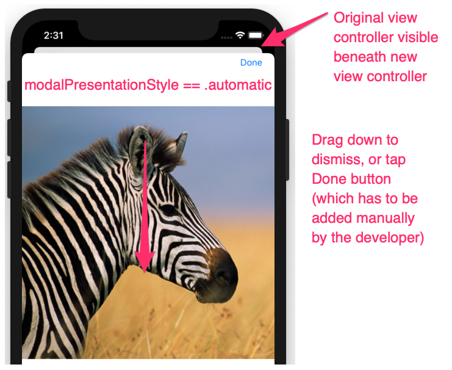
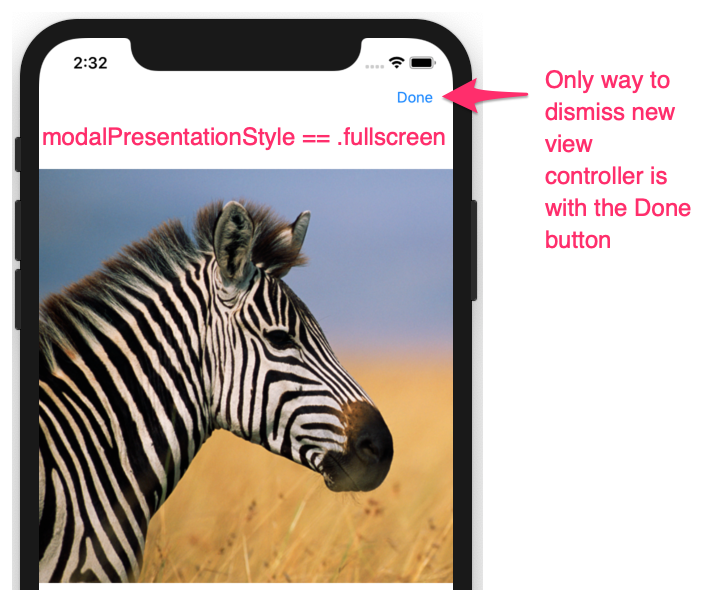
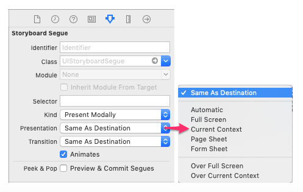

#  presentViewController vs pushViewController

Exploring the differences between presentViewController and pushViewController with new iOS 13 modal presentation styles.



___

With **presentViewController** the new view controller is presented **modally**, “on top” of the existing view controller.
With **pushViewController** the new view controller is pushed onto the existing **navigation stack**.

In iOS 13 there is a new style of presentation for modal view controllers.
Rather than always being presented fullscreen, by default, the new view controller is displayed on top of the existing view 
controller with the existing view controller being partially visible “underneath”. The user can then close/dismiss the new 
view controller by dragging down or tapping off it.

The following summarizes the situation:

### presentViewController
* The new view controller is presented MODALLY
* The new view controller is NOT added to the existing navigation stack and is not contained by your nav controller
* You DO NOT get a navigation bar and back button
* **modalPresentationStyle == .automatic**
  * Presents the new view controller on top of the current view controller
  * The top of current view controller can be seen “underneath” the new view controller
  * The user can dismiss the new view controller by dragging down
  * As it's not part of the navigation stack, there is no navigation bar
* **modalPresentationStyle == .fullscreen**    
  * Presents the new view controller on top of the current view controller
  * The current view controller CANNOT be seen underneath the new view controller
  * There is no way for the user dismiss the new view controller
  * As it's not part of the navigation stack, there is no navigation bar (the user is "stuck")

### pushViewController
* Pushes the new view controller onto the EXISTING navigation stack
* The new view controller is NOT presented modally
* The new view controller is always presented full screen (it's indepedent of modalPresentationStyle)
* You automatically get a navigation bar and back button

The demo shows the main principles involved:


Here we have used **presentViewController** with **modalPresentationStyle == .automatic**:



Here we use **presentViewController** with **modalPresentationStyle == .fullscreen**. 
We can see that without (manually) adding a **Done** button there would be no way for the user to dismiss the new view controller:



``` swift
//
//  ViewController.swift
//  ModalStylesDemo
//
//  Created by Russell Archer on 30/09/2019.
//  Copyright © 2019 Russell Archer. All rights reserved.
//

import UIKit

class ViewController: UIViewController {
    @IBOutlet weak var modalPresentationStylePicker: UIPickerView!
   
    fileprivate var selectedPresentationStyle: UIModalPresentationStyle = .automatic
   
    override func viewDidLoad() {
        super.viewDidLoad()
       
        modalPresentationStylePicker.delegate = self
        modalPresentationStylePicker.dataSource = self
    }
   
    @IBAction func pushViewControllerTapped(_ sender: Any) {
        guard let nvc = storyboard?.instantiateViewController(withIdentifier: "NewViewController") else { return }
        navigationController?.pushViewController(nvc, animated: true)
    }
   
    @IBAction func presentViewControllerTapped(_ sender: Any) {
        guard let nvc = storyboard?.instantiateViewController(withIdentifier: "NewViewController") else { return }
        nvc.modalPresentationStyle = selectedPresentationStyle
        navigationController?.present(nvc, animated: true, completion: nil)
    }
}

// Code related to UIPickerView ommitted

```

Note that you can also control the style of modal presentation when using segues on a storyboard:


